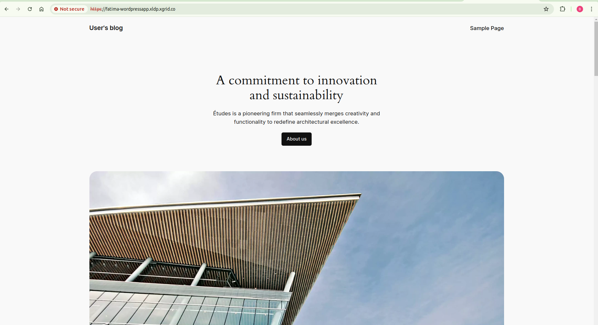
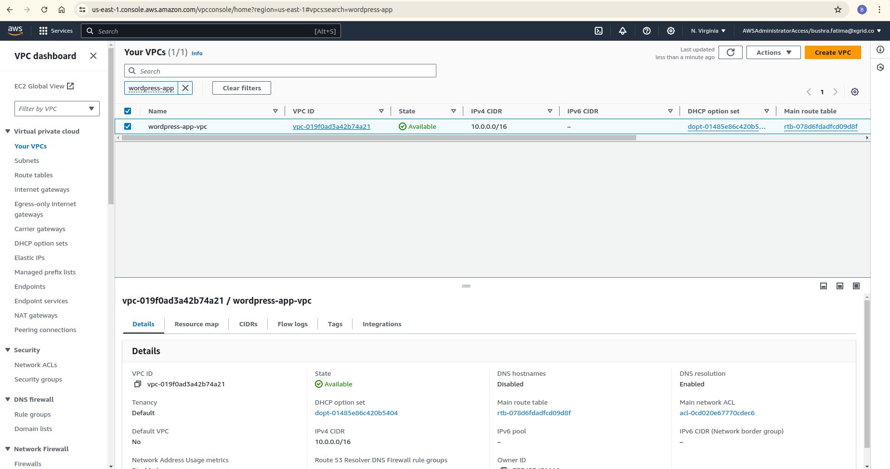
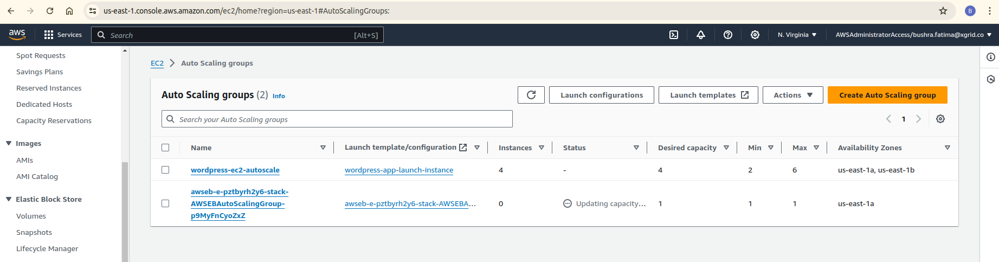
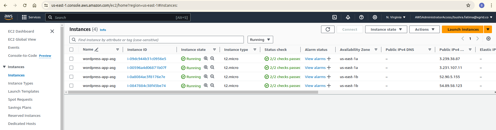
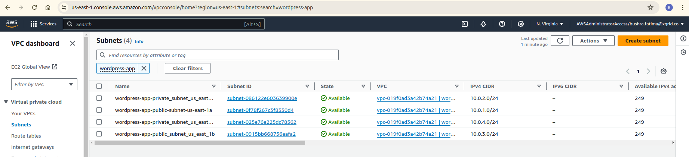
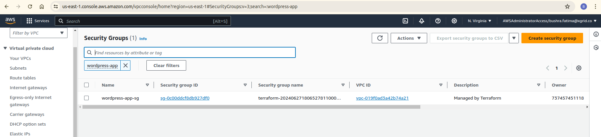
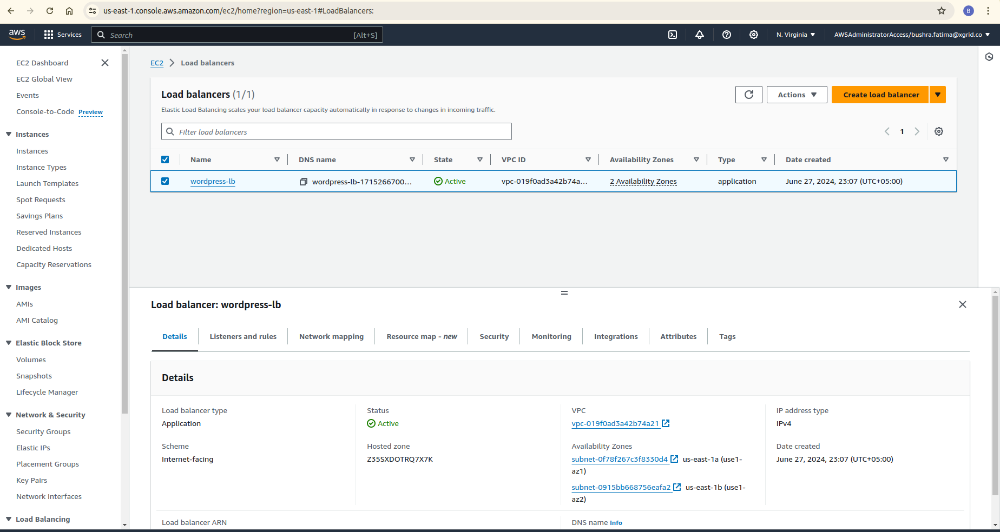

# S208: Deploying a Highly Available & Scalable Wordpress Server on AWS

## Overview

This module focuses on deploying a highly available and scalable Wordpress server using AWS Cloud infrastructure and services. 

key Components are:

> - VPC
> - Subnets (Public & Private)
> - Nat gateway
> - Internet Gateway
> - Security Groups
> - Route Tables
> - Application load balancer
> - Target group
> - Autoscailing group
> - AWS Certificate Manager
> - Route 53
> - Launch configuration
> - CloudWatch Alarms

## Learning Outcomes

> - Learning about Terraform and best practices for using terraform.
> - Creating a Virtual Private Cloud
> - Creating subnets, Internet gateway and security groups in the vpc.
> - Using Route 53 and ACM to generate and validate SSL certificates.
> - Creating a Launch Configuration and Autoscaling Group ( Scalability )
> - Creating an Application Load Balancer and Target Group  ( Availability )
> - Autoscale instances based on cloudwatch alarms

### Installation Instructions

You need to install the following tools:

> - [Terraform](https://www.terraform.io/downloads)
> - [AWS CLI](https://docs.aws.amazon.com/cli/latest/userguide/getting-started-install.html)
> - [Terraform docs](https://terraform-docs.io/user-guide/installation/)
> - [AWS IAM User Account](https://aws.amazon.com/console/)  
> - [Wordpress](https://wordpress.org/download/)

## Getting Started

1.  To initialize the working directory and download the required provider and modules, run the following command:

		`terraform init` 

2.  To see the changes Terraform will make to your AWS environment, run the following command:

		`terraform plan` 

3.  If the plan looks good, run the following command to create the resources:

		`terraform apply` 

4.  To delete the resources, run the following command:

		`terraform destroy` 

## Modules

| Name | Description 
|------|--------|
|  [acm](#module\acm) | module to configure aws certificate manager 
|  [alb](#module\_loadbalancer) | module to configure loadbalancer 
|  [asg](#module\_webserver) | module to configure auto scaling group
|  [route53](#module\_route53) | module to configure route53 
|  [subnet](#module\_subnet) | module to configure subnets, igw, nat gateway and route tables
|  [cloudwatch](#module\cloudwatch) | module to configure cloudwatch alarms

## Outputs

| Name | Description |
|------|-------------|
| [certificate_arn] | arn of the generated certificate |
| [target_group_arn]  | arn of the loadbalancer target group |
| [zone_id]  | Zone id of the Load balancer |
| [dns_name] | DNS name of the Load balancer |
| [route53_zone_id]  | Zone id for the route53 |
| [private_subnet_ids]  | IDs of the private subnet |
| [public_subnet_ids]  | IDs of the public subnet |
| [security_group_id]  | ID of the security group |
| [autoscaling_group_name]  | asg id to monitor |
| [scale_out_policy_arn]  | arn of the scale out policy of asg |
| [scale_in_policy_arn]  | arn of the scale in policy of asg |

## Screenshot
Wordpress app UI

VPC

Auto Scaling group

EC2 Instances

Subnets

Security Groups

Load Balancer

Route 53

